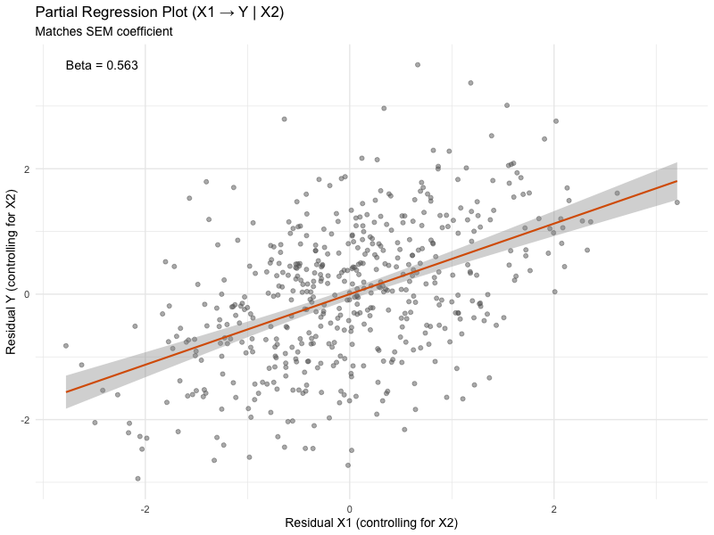
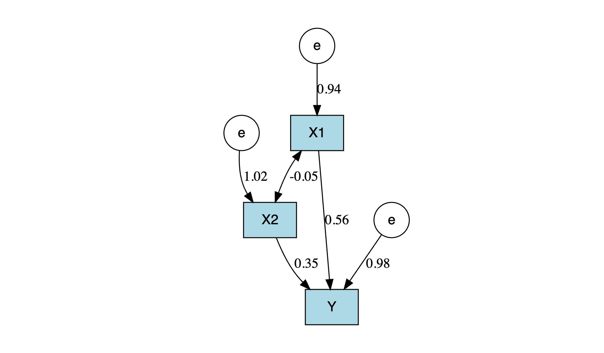

# SEM vs Regression Equivalence

This repository demonstrates that linear regression estimates can be replicated using Structural Equation Modeling (SEM) with only a covariance matrix.

## Key Idea

SEM does not require raw data. If you provide:
- Covariance matrix
- Means
- Sample size

You can recover regression coefficients exactly.

## Files

- `01_generate_data.R`: Simulate dataset
- `02_regression_model.R`: Fit OLS regression
- `03_covariance_sem.R`: Fit SEM using covariance matrix
- `04_compare_results.R`: Compare outputs

## Requirements

```r
install.packages("lavaan")
```

## 📉 Partial Regression Plot (SEM Equivalence)



---

## 🧠 What this plot shows

This figure is a **partial regression plot** illustrating the relationship between `X1` and `Y` **after controlling for `X2`**.

The model of interest is: 
`Y ~ X1 + X2`   

In both **multiple regression** and **SEM** (below), the coefficient for `X1` represents:

> The effect of `X1` on `Y`, **holding `X2` constant**

## 📁 Reproducibility

The plot was generated using:

- `lm()` for regression  
- residualization to compute partial relationships  
- `ggplot2` for visualization  

See the accompanying R script for full implementation.
---

# 📊 SEM vs Regression: Visual Representation

Below is a path diagram of the Structural Equation Model (SEM) fitted using the covariance matrix. This model is equivalent to a standard linear regression of `Y` on `X1` and `X2`.



---

## 🧠 Model Explanation

The diagram represents the following model:
`Y ~ X1 + X2`   

### 🔹 Key Components

- **Directed arrows (→)**  
  Represent regression relationships:
  - `X1 → Y`: Effect of predictor X1 on outcome Y  
  - `X2 → Y`: Effect of predictor X2 on outcome Y  

- **Double-headed arrow (↔)**  
  Represents covariance:
  - `X1 ↔ X2`: Covariance (correlation) between predictors

- **Residual term (e → Y)**  
  Captures variance in `Y` not explained by X1 and X2

---

## 🔬 Interpretation

- The coefficients on the arrows correspond to **regression estimates**  
- The covariance between `X1` and `X2` shows how predictors are related  
- The residual variance reflects unexplained variability in `Y`

---
## 📁 Reproducibility

The plot was generated using:

- `lavaan` for SEM estimation  
- `DiagrammeR` for visualization  

See the `/R` scripts for full code used to generate this figure.

## 📊 SEM vs Regression (Visual Comparison)

| Structural Equation Model | Partial Regression Plot |
|---------------------------|------------------------|
|  |  |

---

## 🧠 Interpretation

- **Left (SEM diagram):**
  - Shows structural relationships:
    - `X1 → Y`
    - `X2 → Y`
    - `X1 ↔ X2`

- **Right (partial regression):**
  - Shows the effect of `X1` on `Y`
  - After controlling for `X2`

---

## ✅ Key Insight

The slope in the partial regression plot is **identical** to the path:
    - `X1 → Y`    
    in the SEM diagram.

👉 This demonstrates:

> **SEM coefficients = partial regression coefficients**
